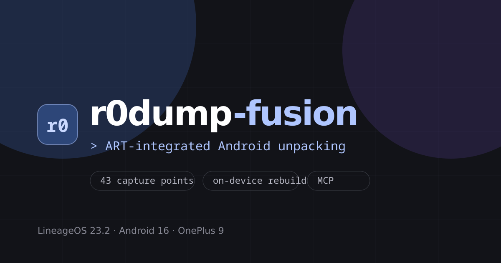

# R0DUMP

> 中文 · [English](README.en.md) · [官网](https://r0dump.com)

> [!WARNING]
> 官方刷机包只适配 **OnePlus 9（lemonade / sm8350）**，不可刷入其他设备。解锁、刷机和 test-keys 构建会降低设备安全性，并可能导致数据丢失或变砖。请先备份，并确认设备、版本和校验信息。
>
> 本项目仅供安全研究、互操作性分析与学习交流。请只分析你拥有或已获明确授权的软件和设备。使用风险由使用者自行承担。

  

  <a href="#下载"><strong>下载</strong></a>
  &nbsp;·&nbsp;
  <a href="#基本用法"><strong>基本用法</strong></a>
  &nbsp;·&nbsp;
  <a href="docs/zh/PORTING.md"><strong>移植指南</strong></a>
  &nbsp;·&nbsp;
  <a href="#社区移植"><strong>社区移植</strong></a>
  &nbsp;·&nbsp;
  <a href="patches/v2026-09-12-fusion"><strong>Fusion 补丁</strong></a>
  &nbsp;·&nbsp;
  <a href="https://github.com/tiwe0/r0dump/releases/latest"><strong>最新版本</strong></a>

`R0DUMP` 将 [`FART`](https://github.com/hanbinglengyue/FART) 的主动调用思路移植到 **Android 16 / ART**。它直接在 ART 中捕获常规与内存 DEX，重建运行时结构，并通过 **R0dump Manager** 完成配置、修复、校验和 ZIP 导出。导出的 DEX 可继续使用 `dexdump` 或 JADX 检查。

欢迎提供无法正常捕获、修复或导出的不适配样本，帮助定位兼容性问题并完善项目。请联系 [contact@ivory.cafe](mailto:contact@ivory.cafe)。

## 核心能力

- **ART 集成捕获**：覆盖 DEX 注册、类加载和方法分派等关键路径，不需要第三方 hook 框架或运行时注入。
- **FART 式主动调用**：延迟遍历已加载的 ClassLoader 并触发方法，使加固壳在运行时解密代码。
- **内存 DEX 捕获**：捕获 `InMemoryDexClassLoader` 加载、绕过标准加载链的业务 DEX。
- **DEX 重建**：按 `runtime_view` 还原位移的 ID 表和段计数，在设备端恢复为标准 DEX，并重算 Adler-32 / SHA-1。
- **稳定性保护**：异步队列执行 DUMP，并提供预算、范围和 ANR 保护。
- **R0dump Manager**：提供目标 App 选择、策略配置、运行状态、修复、校验与 ZIP 导出；另含通过 ADB 标准输入输出使用的内嵌 MCP 桥。

## 下载

当前官方参考构建为 `r0dump-fusion-16`，基于 **LineageOS 23.2 / Android 16**，适配 **OnePlus 9（lemonade / sm8350）**，使用测试密钥签名。

| 版本 | 说明 | 下载 |
|------|------|------|
| 无 GApps | 纯净 ROM，包含全部 R0DUMP 能力 | [nogapps.zip](https://dl.r0dump.com/v2026-09-12/lineage_lemonade-r0dump-fusion-16-nogapps.zip) |
| GApps 版 | `product` / `system_ext` 已离线注入 MindTheGapps | [gapps.zip](https://dl.r0dump.com/v2026-09-12/lineage_lemonade-r0dump-fusion-16-gapps.zip) |
| 源码补丁包 | 用于可复现移植的 Fusion 补丁集 | [版本页面](https://github.com/tiwe0/r0dump/releases/tag/v2026-09-12-fusion) |

也可从 [r0dump.com](https://r0dump.com) 下载。开始前请阅读 [Fusion 刷机指南](docs/zh/FLASHING.md)；GApps 版刷写 `vbmeta` 时需要 `--disable-verification`。

## 基本用法

1. 在已刷入匹配构建的 OnePlus 9 上打开 R0dump Manager，选择你有权测试的目标 App。
2. 选择进程模式与 DUMP 策略；默认配置面向一、二代壳基线。
3. 启用捕获并冷启动目标 App，等待任务自动结束。
4. 点击“修复并导出最新产物”。
5. 从 `/sdcard/Downloads/r0dump-exports/` 取出 ZIP 和对应 SHA-256 文件，再用 JADX / `dexdump` 检查结果。

## 效果

| 脱壳前 | 捕获、重建并修复后 |
|--------|--------------------|
|  |  |

## 补丁与移植

源码改动以 `git format-patch` 形式提供，可移植到其他设备和 Android 16 构建。建议新移植从[移植指南](docs/zh/PORTING.md)开始。

| 目录 | 说明 |
|------|------|
| [`patches/v2026-07-18-seen/`](patches/v2026-07-18-seen) | 早期 FART 式版本，保留用于历史参考。 |
| [`patches/v2026-09-12-fusion/`](patches/v2026-09-12-fusion) | 当前 Fusion 基线：ART 捕获、容器与内存 DEX 重建、完整 Manager、MCP 桥及 GApps 离线注入配套。 |

Fusion 补丁集按 `art`、`frameworks/base`、`system/sepolicy`、`packages/apps/R0dumpManager`、`vendor/lineage` 分组。准确基线、应用顺序和冲突处理见[补丁说明](patches/v2026-09-12-fusion/README.md)。

## 社区移植

社区移植由各自维护者独立发布和维护；基线、安装方式与验证范围均以对应仓库为准。

| 设备 / ROM | 维护者 | 状态与证据 | 源码 |
|------------|--------|------------|------|
| Redmi 9A（`blossom` / `dandelion`）· crDroid 12.11 · Android 16 | [`yruh`](https://github.com/yruh) | 提供可复现的补丁与覆盖文件；已完成真机启动、Manager、DUMP、修复和 ZIP 导出，修复后的 DEX 已通过 Android 16 `dexdump` | [`yruh/r0dump-redmi9a-crdroid16`](https://github.com/yruh/r0dump-redmi9a-crdroid16) |

如需提交新设备移植，请按[移植指南中的收录清单](docs/zh/PORTING.md#提交社区移植)提供源码基线、补丁、构建结果、真机验证范围和安全说明，再提交 Issue 或 PR。收录项目应可复现、边界清晰，且不包含专有二进制文件、私钥或用户数据。

## 项目边界

- 官方可刷镜像目前只有 OnePlus 9 参考构建；其他设备请根据对应的社区移植自行构建。
- R0DUMP 不能保证恢复所有加固方案或所有动态生成代码。成功与否取决于代码何时解密、ART 可观测路径、捕获预算和样本行为。
- Manager 导出的 ZIP、报告和校验文件用于研究取证；请保留原始样本、构建信息和授权记录。

## 技术背景与开发说明

本项目用于研究 `FART` 的运行时主动调用思路，并验证其在 Android 16 / LineageOS 23 上的迁移、边界强化和工程化能力。开发中使用了大模型辅助源码阅读、版本差异整理、代码修改与日志分析；结论结合实际 patch、构建结果、真机运行及 dump / repair 产物核对。

技术文章：[r0dump：Android 16 上的 ART 脱壳实践](https://bbs.kanxue.com/thread-292107.htm)

## 致谢

- 感谢 [`r0ysue`](https://github.com/r0ysue) 老师的指导与建议。
- 感谢 `寒冰冷月` 老师的 [`FART`](https://github.com/hanbinglengyue/FART) 项目与系列文章：
  - [FART：ART 环境下基于主动调用的自动化脱壳方案](https://bbs.kanxue.com/thread-252630.htm)
  - [FART 正餐前甜点：ART 下几个通用简单高效的 dump 内存中 dex 方法](https://bbs.kanxue.com/thread-254028.htm)
  - [拨云见日：安卓 App 脱壳的本质以及如何快速发现 ART 下的脱壳点](https://bbs.kanxue.com/thread-254555.htm)
- 感谢 **看雪社区** 的公开讨论与样本。

## 关注趋势

如果 R0DUMP 对你有用，欢迎 Star。

